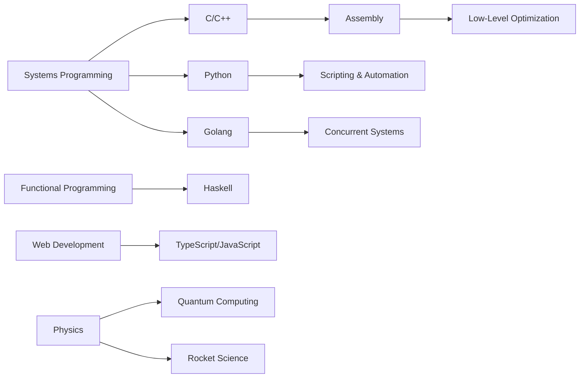

<div align="center">
  
# 🚀 Systems Programmer & Quantum Explorer


[](https://github.com/Serosh-commits)
[](https://github.com/Serosh-commits?tab=followers)

</div>

---

## 👨‍💻 About Me

```typescript
const systemsProgrammer = {
  name: "YOUR_NAME",
  role: "Systems Programmer",
  location: "YOUR_LOCATION",
  education: "Learning Rocket Science 🚀",
  
  interests: [
    "Quantum Physics ⚛️",
    "Rocket Science 🚀", 
    "Low-Level Programming",
    "Operating Systems",
    "Physics Simulations"
  ],
  
  currentlyLearning: ["Haskell", "Assembly", "TypeScript"],
  
  proficientIn: ["C", "C++", "Python", "Golang"],
  
  operatingSystem: "Arch Linux BTW 🐧",
  
  dailyWorkflow: {
    editor: "Neovim",
    terminal: "Alacritty",
    versionControl: ["Git", "GitLab"],
    shell: "Zsh"
  }
};
```

---

## 🛠️ Tech Stack

### Core Languages
<div align="center">


</div>

### Currently Learning
<div align="center">


</div>

### Tools & Environment
<div align="center">


</div>

---

## 📊 GitHub Stats

<div align="center">
  
  
</div>

<div align="center">
  
</div>

---

## 🏆 GitHub Trophies

<div align="center">
  
</div>

---

## 📈 Contribution Graph

<div align="center">
  
</div>

---

## 🔥 Projects Showcase

### 🎯 Featured Repositories

<div align="center">

[](https://github.com/Serosh-commits/P.A)
[](https://github.com/Serosh-commits/inter-cpp)

</div>

---

## 🎓 Learning Journey



---

## ⚡ Current Focus

<div align="center">

| Area | Status | Details |
|------|--------|---------|
| 🔧 Systems Programming | ⭐⭐⭐⭐⭐ | Expert in C/C++, Python, Golang |
| 📚 Functional Programming | 🔄 Learning | Diving deep into Haskell |
| 💻 Low-Level Programming | 🔄 Learning | Mastering Assembly |
| 🌐 Web Development | 🔄 Learning | TypeScript & Modern JS |
| ⚛️ Quantum Physics | 📖 Studying | Quantum mechanics & computing |
| 🚀 Rocket Science | 📖 Studying | Orbital mechanics & propulsion |

</div>

---

## 🌐 Connect With Me

<div align="center">

[](https://github.com/Serosh-commits)
[](mailto:YOUR_EMAIL)

</div>

---

## 💭 Random Dev Quote

<div align="center">


</div>

---

## 🐍 Contribution Snake

<div align="center">
  
</div>

---

<div align="center">

### 🚀 *"In the realm of bits and bytes, we build the future"*


**Made with 💙 and ⚡ by janmejaya panda**

</div>

